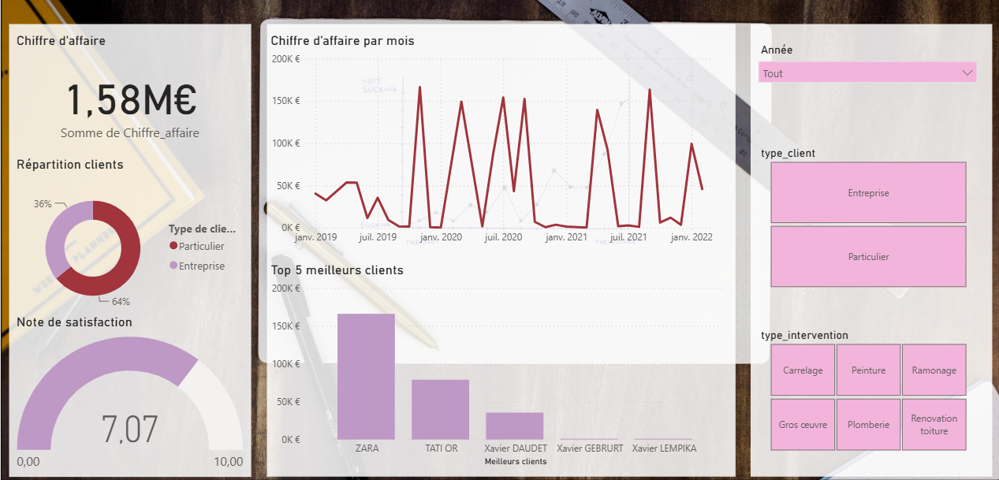
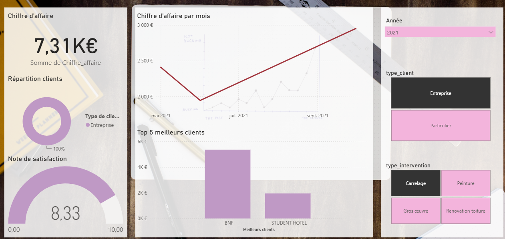

## Dashboard de datavisualisation sur Power BI

#### *Présentation*
Ce projet a été réalisé dans le cadre de mon M1 Méga-données et Analyse Sociale (MEDAS). L'objectif était de concevoir un tableau de bord interactif permettant de synthétiser et visualiser différents indicateurs liés à l'activité et aux clients.

#### *Éléments du dashboard*
- Suivi du chiffre d'affaires
- Analyse de la satisfaction client
- Évolution de l'activité dans le temps
- Identification des principaux clients
- Segmentation des données
- Filtres interactifs permettant d'explorer les résultats

#### *Outils*
- Power BI
- Visualisation de données
- Création et suivi de KPI

#### *Fichier*
**projet_datavisualisation.pbix** contient le tableau de bord Power BI complet et interactif.

#### *Aperçu du dashboard*
Vue globale du dashboard :  

Exemple après sélection de l'année 2021, du type de client « Entreprise » et de l'intervention « Carrelage ».  

